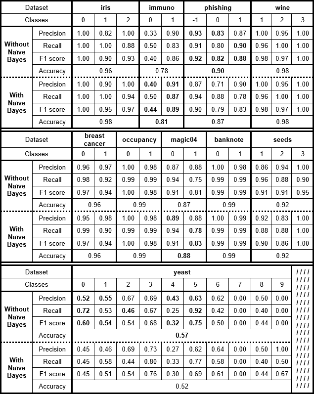
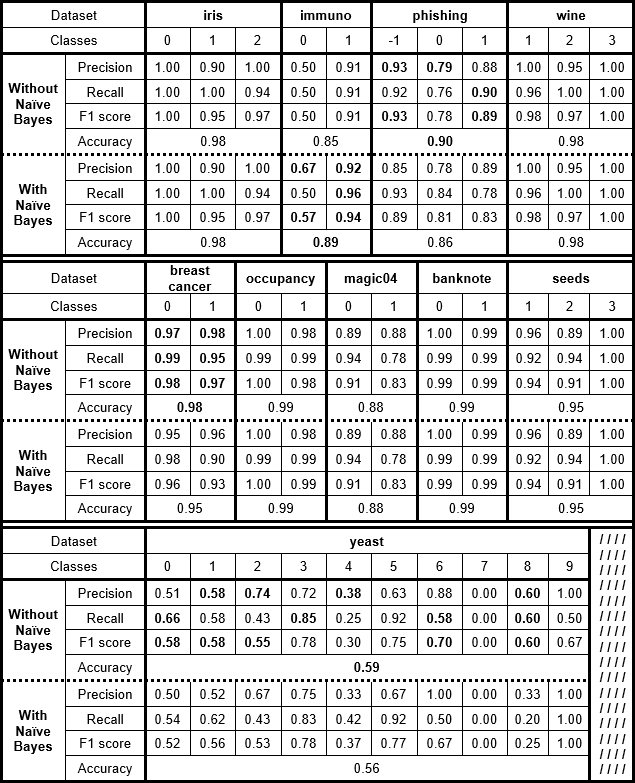
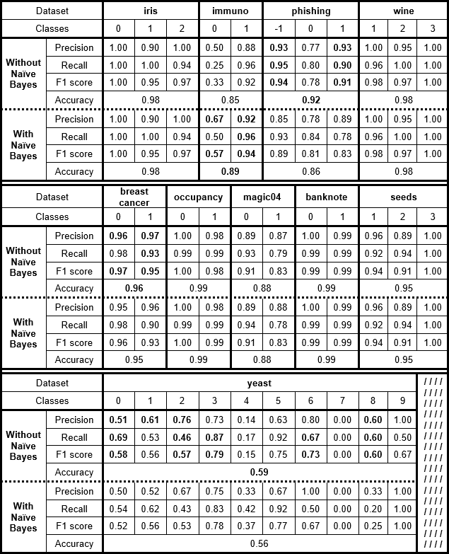

# NBRandomForest

### Authors 
Shaked Hindi & Yoni Birman

## Datasets
1.  [Iris](https://archive.ics.uci.edu/ml/datasets/Iris)
2.  [Immunotherapy](https://archive.ics.uci.edu/ml/datasets/Immunotherapy+Dataset)
3.	[Phishing](https://archive.ics.uci.edu/ml/datasets/Phishing+Websites)
4.	[Wine](https://archive.ics.uci.edu/ml/datasets/Wine)
5.	[Breast Cancer Diagnostics](https://archive.ics.uci.edu/ml/datasets/Breast+Cancer+Wisconsin+%28Diagnostic%29)
6.	[Occupancy Detection](https://archive.ics.uci.edu/ml/datasets/Occupancy+Detection+)
7.	[MAGIC Gamma Telescope](https://archive.ics.uci.edu/ml/datasets/MAGIC+Gamma+Telescope)
8.	[Banknote Authentication](https://archive.ics.uci.edu/ml/datasets/banknote+authentication)
9.	[Seeds](https://archive.ics.uci.edu/ml/datasets/seeds)
10.	[Yeast](https://archive.ics.uci.edu/ml/datasets/Yeast)

## Results

A comparison has been perfomed between 3 configurations, while 4 measures were taken 
into account: Precision, Recall & F1-score (for each class), and Accuracy (for each 
dataset) - [see summary below](#summary).  
It must be taken into account, that for consistancy and reproducability of the results, 
the `random_state` value was fixated in both the models and the data split criterion.

It can be seen, that in some of the cases there was a slight improvement in the predicion 
results of the RandomForest with NaiveBayes in leaves, while in some other cases the 
results were slightly worst. In most cases, the results were very similar and even 
identical for some.

Also, we can see that adding more trees to the forest indeed improved the 
prediction results for almost all datasets.

Moreover, the usage of NaiveBayes models in the leaves of the DecisionTrees required 
more memory and more computational power, therefore, prediction time became longer.  
This phenomenon was much more significant for larger datasets and for datasets with 
large number of classes.

## Conclusions

- There is no major difference in predicition results between the ordinary RandomForest 
and the one with NaiveBayes models in the leaves. Hence, if considering this fact, the 
extra computational power and the longer prediction times - the "benefit" does not 
justify the additional costs, so we will probably use the regular RandomForest in most 
of future uses.
- There are some hyper-paramters that can be tuned in order to reach better results:
  - Number of trees in the forest - as the forest gets bigger, it takes into account 
  more results, which means it will probably reach better results (Wisdom of the crowd).  
  Of course, it has to be taken into account that generating larger forests requires 
  more computational power. - **This value has the largest influence on the results**
  - Minimum samples in leaves - once the number of samples in each leaf is restricted 
  to a minimal number of samples, it enforces the trees to make more generalized 
  decisions. This way we can avoid overfitting and improve our chances to get better 
  results for new unseen samples.
  - Minimum sample split - similar to the previous case.

## Summary

1. RandomForest with 10 DecisionTrees

2. RandomForest with 100 DecisionTrees

3. RandomForest with 100 DecisionTrees and minimum 15 samples in leaves

